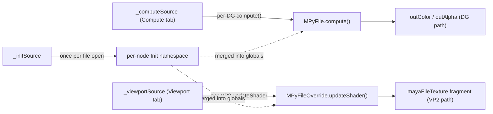

# mPyFile

**Plugin:** `mpynode_api2` · **Inherits:** `MPxNode` + `MPxShadingNodeOverride` (API 2.0) · **Type ID:** `0x00135720`

Expression-driven file-texture shading node. Recreates Maya's stock
`file` node behaviour with EVERY line of the image-processing pipeline
exposed as user-editable Python in the Node Designer. Drag it into a
Lambert / Blinn / Phong shader's `.color` channel and it shades a
mesh in Viewport 2.0, Hypershade swatch, and Maya Software render --
exactly like a normal `file` node would.

The node is a port of [`MayaCustomFileNode/customFileTexture`](../../../MayaCustomFileNode/plug-ins/customFileTexture.py)
into the mpynode framework. Where customFileTexture hard-codes the
color-space + kernel + sampling math in C-level Python, mPyFile
ships the same math as the *default* Init source so the user can
read, tweak, or replace any part of it without recompiling a plug-in.

---

## Source-tier code model

mPyFile was the first mpynode to use **Init + Compute + Viewport**
together, and it ALSO exposes an **OSL** render-target tab (a connectable
`osl` string output authored by hand or via the "Translate Compute → OSL"
action) plus the base-class **Methods** and **Metadata** tabs every wrapper
inherits.

| Tier | Plug | Runs when | Default behaviour |
|---|---|---|---|
| Init | `_initSource` | Once per file open | Defines the color-space conversions, gamut matrices, EOTFs, kernel builders, `_linearize`, `_prefilter`, `_load_linear_pixels`, `_sample`, VP2 enum maps, `_upload_linear_texture`. ~550 LOC of math. |
| Compute | `_computeSource` | Per DG `compute()` call | Reads `self.uvCoord` and the linearized pixel buffer from the Init namespace, bilinearly samples, writes `self.outColor` + `self.outAlpha`. ~37 LOC. |
| Viewport | `_viewportSource` | Per VP2 `MPxShadingNodeOverride.updateShader` call | Builds the GPU texture via `texture_manager.acquireTexture`, builds the sampler state via `omr.MStateManager.acquireSamplerState`, pushes both into Maya's stock `mayaFileTexture` shader fragment. ~35 LOC. |

In the Node Designer the right pane shows the **Init**, **Compute**, and
**Viewport** tabs (plus the node's **OSL**, **Methods**, and **Metadata**
tabs).

`self.time` is **always available** in both the Compute and Viewport tabs
(the wrapper auto-wires `time1.outTime`), so image-sequence expressions
can index by frame with no manual setup. It is a `TimeFloat`: it defaults
to the current frame and also carries the scene frame rate via
`self.time.fps` and `self.time.asSeconds()`. The node re-evaluates each
frame, so a sequence animates on scrub/playback; detect sequence-vs-static
yourself (e.g. parse the path for `#` padding, or add a boolean input).



---

## Preset plug surface

Identical to `customFileTexture` (so behaviour, defaults, and enum
indices match 1:1):

| Group | Attribute | Type | Default | Notes |
|---|---|---|---|---|
| Identity | `fileName` | string (filename) | empty | Texture file path. |
| | `uvCoord` | compound float2 | (0, 0) | Driven by `place2dTexture.outUV` in Hypershade. |
| | `uvFilterSize` | compound float2 | (0, 0) | Hypershade fills this. |
| Color-space | `colorSpace` | enum (25 entries) | `[Texture] sRGB Encoded Rec.709 (sRGB)` | Stable indices; saved scenes round-trip. |
| CPU pre-filter | `preFilter` | bool | False | Toggle blur pass at load time. |
| | `preFilterKernel` | enum (Box / Quadratic / Quartic / Gaussian) | Gaussian | |
| | `preFilterRadius` | float [0.0..8.0] | 2.0 | |
| GPU sampler | `filterMode` | enum (Point / Linear / Anisotropic) | Anisotropic | |
| | `maxAnisotropy` | int [1..16] | 16 | Only used when `filterMode = Anisotropic`. |
| | `mipmapMode` | enum (None / Auto) | Auto | |
| | `mipLODBias` | float [-8..+8] | 0.0 | Negative = sharper. |
| | `minLOD` | int [0..16] | 0 | Smallest mip the GPU may use. |
| | `maxLOD` | int [0..16] | 16 | Largest mip the GPU may use. |
| | `wrapModeU` / `wrapModeV` | enum (Wrap / Clamp / Mirror / Border) | Wrap | |
| | `borderColor` | color3 | (0, 0, 0) | Used when wrap = Border. |
| Outputs | `outColor` | color3 | computed | Bilinear-sampled scene-linear color. |
| | `outAlpha` | float | computed | |

User-added inputs are supported too -- call `wrapper.add_input_attr(...)`
exactly like on `mPyNode`. They appear in the Init / Compute / Viewport
namespace as `self.<name>` alongside the presets.

---

## Example

Create an `mPyFile` with `MPyFile.create()` (it auto-seeds the stock file-texture pipeline), point it at an image, then sample its `outColor` headlessly by driving the UV plugs and reading the output plug -- which fires `compute()` through the default Compute expression and its `self.outColor` write:

```python
import os
import maya.cmds as mc
from mpynode.wrappers.mpy_file import MPyFile

mc.file(new=True, force=True)

# A brand-new mPyFile ships with the customFileTexture color-space +
# bilinear-sampling pipeline seeded in its Init / Compute / Viewport tabs,
# so it behaves like a stock file node out of the box.
tex = MPyFile.create(name="diffuseTex")

# Point it at a real image (the shipped 8x8 test grid).
asset = os.path.join(
    os.environ.get("MPYNODE_ROOT", ""),
    "scripts", "mpynode", "_demos", "data", "test_grid.png",
)
tex.set_file_name(asset if os.path.isfile(asset) else "")

# Sample the centre of the texture HEADLESS: drive the UV plugs, then
# getAttr the output. This fires DG compute() -> the default Compute
# expression -> _sample(...), which writes self.outColor / self.outAlpha.
mc.setAttr(tex.get_name() + ".uCoord", 0.5)
mc.setAttr(tex.get_name() + ".vCoord", 0.5)
color = mc.getAttr(tex.get_name() + ".outColor")[0]
alpha = mc.getAttr(tex.get_name() + ".outAlpha")

# Every channel is a finite value in [0, 1]. With PIL present this is the
# grid colour at UV (0.5, 0.5); on a mayapy without PIL (e.g. Maya 2024)
# the pipeline returns the documented magenta fallback (1, 0, 1) -- either
# way a valid finite sample proving compute() ran through the self.X path.
assert len(color) == 3, color
assert all(0.0 <= c <= 1.0 for c in color), color
assert 0.0 <= alpha <= 1.0, alpha
print("mPyFile outColor =", tuple(round(c, 4) for c in color),
      "outAlpha =", round(alpha, 4))
```

---

## Default Init source -- what the user sees in the Init tab

The default Init source defines (all ~550 LOC are in the Init tab):

* Gamut matrices: `_M_AdobeRGB_to_Rec709`, `_M_P3D65_to_Rec709`,
  `_M_Rec2020_to_Rec709`, `_M_AP0_to_Rec709`, `_M_AP1_to_Rec709`,
  `_M_AlexaWide_to_Rec709`, `_M_REDWide_to_Rec709`, `_M_SGamut3_to_Rec709`.
* Transfer functions: `_srgb_eotf`, `_gamma_eotf`, `_apply_matrix`,
  `_acescct_eotf`, `_logc_v3_ei800_eotf`, `_red_log3g10_eotf`,
  `_slog3_eotf`, `_adx10_eotf`.
* Pre-filter kernels: `_gaussian_kernel`, `_box_kernel`,
  `_quadratic_kernel`, `_quartic_kernel`, `_blur_separable`.
* Image pipeline: `_linearize(pixels_uint8, cs_index)`,
  `_prefilter(linear, enabled, kernel, radius)`,
  `_load_linear_pixels(path, cs, prefilter, kernel, radius)`.
* DG sampler: `_apply_wrap`, `_sample`.
* VP2 plumbing: `_vp2_filter_for`, `_vp2_wrap_for`,
  `_upload_linear_texture`.
* Enum constants: `kFilterPoint`, `kWrapWrap`, `kPreFilterGaussian`, etc.

The 25-entry color-space name catalogue (`_COLOR_SPACE_NAMES`) is **not** in
the Init source -- it is a built-in constant in the plugin code
(`scripts/mpynode/_api2/mpy_file.py`) that `initializer()` uses to build the
`colorSpace` enum. The index order is stable (0 = sRGB Rec.709 default,
7 = Gamma 2.2 AdobeRGB). The conversion *math* keyed off those indices lives
in the Init tab and is fully editable.

Everything is plain Python + numpy + PIL (optional, with graceful
fallback). Modify any line; the Init namespace re-runs at file open
and the new helpers feed both Compute and Viewport immediately.

---

## Two parallel sampling paths (same as customFileTexture)

| Context | Path |
|---|---|
| `cmds.getAttr` / Maya Software / Arnold-CPU | `compute()` -> Compute expression -> `_sample(linear, u, v, ...)` |
| Hypershade swatch | `compute()` (same as DG) |
| **Viewport 2.0 / `ogsRender`** | **`MPxShadingNodeOverride.updateShader` -> Viewport expression -> `texture_manager.acquireTexture` + `state_manager.acquireSamplerState`** |
| GPU renderers (Arnold-GPU / Redshift / V-Ray) | Each renderer needs its own shader translator (deferred, same caveat as customFileTexture). |

The VP2 path reuses Maya's built-in `mayaFileTexture` shade-fragment
graph -- the SAME fragment that the stock `file` node uses. Viewport
code just rebinds the `map` parameter (the float32 RGBA pixel buffer
uploaded by `_upload_linear_texture`) and the sampler parameter
(`MSamplerStateDesc` built from the preset plug values). No custom
GLSL / HLSL anywhere in the plug-in.

---

## Worked example -- edit a gamut matrix in the Init tab

The Init tab ships with `_M_AdobeRGB_to_Rec709` declared explicitly:

```python
_M_AdobeRGB_to_Rec709 = np.array(
    [[1.39838, -0.39838, 0.00000],
     [0.00000,  1.00000, 0.00000],
     [0.00000, -0.04293, 1.04293]], dtype=np.float32)
```

Want to deliberately desaturate the AdobeRGB path? Replace it with a
half-strength matrix in the Init tab and hit Save:

```python
_M_AdobeRGB_to_Rec709 = np.array(
    [[1.20, -0.20, 0.00],
     [0.00,  1.00, 0.00],
     [0.00, -0.02, 1.02]], dtype=np.float32)
```

Set `colorSpace = [Texture] Gamma 2.2 Encoded AdobeRGB` (index 7) on
any mPyFile and the new matrix is what both `compute()` (DG path)
and `updateShader` (VP2 path) use -- because both run with the Init
namespace merged into their globals.

---

## Worked example -- swap the bilinear sampler for nearest

The Compute tab's default sampling is the `_sample(...)` call (it also
loads/linearizes the pixels and reads `uvCoord` / `borderColor`). Replace
that `_sample(...)` call with a manual nearest-neighbour lookup:

```python
linear = _load_linear_pixels(self.fileName, int(self.colorSpace),
                              bool(self.preFilter),
                              int(self.preFilterKernel),
                              float(self.preFilterRadius))
u, v = self.uvCoord
if linear is None:
    self.outColor = (1.0, 0.0, 1.0); self.outAlpha = 1.0
else:
    h, w, _ = linear.shape
    x             = int((u % 1.0) * (w - 1))
    y             = int(((1.0 - (v % 1.0))) * (h - 1))  # Maya V is bottom-up
    p             = linear[y, x]
    self.outColor = (float(p[0]), float(p[1]), float(p[2]))
    self.outAlpha = float(p[3])
```

The DG path now reads the texture with no interpolation. The VP2
path is untouched (Viewport tab still uses the GPU sampler) -- which
is a feature, not a bug: hardware texture units have a fast Point
filter mode (`filterMode = Point`) that achieves the same effect
without paying any Python overhead.

---

## Implementation pointers

| File | Purpose |
|---|---|
| [`plug-ins/mpynode_api2.py`](../../plug-ins/mpynode_api2.py) | `registerNode` + `MDrawRegistry.registerShadingNodeOverrideCreator` + `auto_dirty` hook. |
| [`scripts/mpynode/_api2/mpy_file.py`](../../scripts/mpynode/_api2/mpy_file.py) | `MPyFile(MPxNode)` and `MPyFileOverride(MPxShadingNodeOverride)`. `compute()` runs the Compute expression; `updateShader` delegates to `MPyFile.runViewport(...)`. |
| [`scripts/mpynode/wrappers/mpy_file.py`](../../scripts/mpynode/wrappers/mpy_file.py) | User-facing `MPyFile` wrapper. Inherits `MPyNode` (attr / variable / init / profile-watch API) plus `ViewportSourceMixin` (adds the Viewport tab) and `OslSourceMixin` (adds the OSL tab). |
| [`scripts/mpynode/_defaults/file_defaults.py`](../../scripts/mpynode/_defaults/file_defaults.py) | The default source strings shipped with `MPyFile.create()`. |
| [`scripts/mpynode/_common/viewport_registry.py`](../../scripts/mpynode/_common/viewport_registry.py) | `ViewportSourceMixin` -- adds `set_viewport_expression` / `get_viewport_expression` (also `clear_` / `has_`) to any opt-in wrapper. |
| [`scripts/mpynode/ui/widgets/viewport_editor.py`](../../scripts/mpynode/ui/widgets/viewport_editor.py) | `NDViewportEditor` -- the Node Designer's Viewport-tab editor. |
| [`scripts/mpynode/ui/widgets/script_tab_content.py`](../../scripts/mpynode/ui/widgets/script_tab_content.py) | Renames Expression tab to Compute; adds the Viewport tab when the wrapper opts in. |

---

## Caveats

* **PIL is optional.** Maya 2026's `mayapy` ships with PIL; Maya 2024's
  does not. If PIL is missing, `_load_linear_pixels` returns `None` and
  the Compute path outputs magenta (the same fallback `customFileTexture`
  uses).
* **GPU renderers (Arnold-GPU / Redshift / V-Ray).** Each renderer
  has its own shader translator. Arnold-CPU calls our `compute()` via
  the OM API so it Just Works. Arnold-GPU / Redshift / V-Ray would
  each need a dedicated shader translator -- same caveat as
  `customFileTexture`, deferred to future phases.
* **MTypeId `0x00135720`** is in mpynode's private dev-only range. For
  shipping plug-ins, request a registered ID block from Autodesk.

---

## Demo

Create one from **New from Template → textures →
`file_brightness_contrast`** (or the `textures` file-simple /
file-scanline templates): a sphere + plane shaded by an `mPyFile` loaded
with the shipped `test_grid.png`. In Maya 2026 you'll see the 8x8 test
grid wrapped around the sphere; open the Node Designer to read or edit
the Init / Compute / Viewport sources.

---

## See also

* [`MayaCustomFileNode/README.md`](../../../MayaCustomFileNode/README.md) -- the original, hard-coded customFileTexture this node ports from.
* [`MayaCustomFileNode/DEVELOPER_GUIDE.md`](../../../MayaCustomFileNode/DEVELOPER_GUIDE.md) -- handbook on `MPxShadingNodeOverride` lifecycle, classification strings, VP2 fragment-graph reuse.
* [`MayaCustomFileNode/LEARNINGS.md`](../../../MayaCustomFileNode/LEARNINGS.md) -- the 14 indexed gotchas that drove the original implementation. All still apply -- mPyFile inherits the same fragment-reuse trick.

---

## Verification notes (Maya 2026 mayapy + macOS 26 Tahoe)

Maya 2026's `mayapy` ships with Qt 6.5.3, which probes the legacy
`hw.optional.neon` and `hw.optional.armv8_crc32` sysctl keys at
startup. Apple removed those keys in macOS 26 (Tahoe), so Maya 2026's
`mayapy` aborts with `Incompatible processor. This Qt build requires
the following features: neon crc32` on Tahoe. The runtime mayapy is
also hardened (`flags=0x10000(runtime)` per `codesign -dv`), so
`DYLD_INSERT_LIBRARIES` shims are ignored. The fix has to come from
Autodesk (rebuilt Qt) or Apple (restored legacy keys).

This is **not** mPyFile-specific -- it affects any test that calls
`maya.standalone.initialize()` against Maya 2026 on macOS 26. For
verification on macOS 26 systems, use Maya 2024's `mayapy`
(`/Applications/Autodesk/maya2024/Maya.app/Contents/bin/mayapy`),
which works fully and runs:

- All 34 mPyFile tests (31 pass, 3 PIL-skipped -- PIL ships only with
  Maya 2026's `mayapy`).
- The 1224-test mpynode sweep (1223 pass, 1 pre-existing flake
  unrelated to mPyFile).
- The 19-demo audit including `mPyFile_texture` (19/19 PASS).

Every new Python file is **byte-compile-verified on Maya 2026's
Python 3.11 too** (Python parse + ast OK), so cross-version source
compatibility is confirmed; only the Qt-level standalone init is
blocked. Once Autodesk ships a Maya 2026 update with refreshed Qt,
or Apple restores the legacy sysctl keys, mPyFile will work on
Maya 2026 with zero additional changes.

In interactive Maya 2026 launched normally (the GUI, not mayapy),
the Qt CPU-feature check is sometimes bypassed by the host process
having already been launched by the Maya launcher script -- so
interactive Maya 2026 sessions may work fine even when `mayapy 2026`
crashes from the command line.
